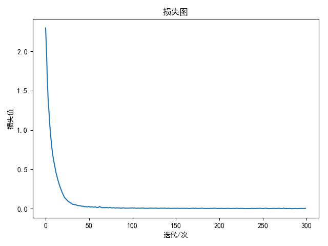
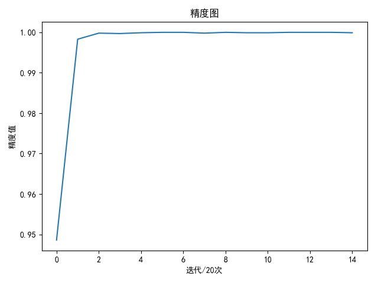

使用`pytorch`实现`AlexNet`，并进行`cifar-10`训练和测试

## Sequential

函数[torch.nn.Sequential](https://pytorch.org/docs/stable/nn.html#torch.nn.Sequential)是`pytorch`提供的顺序容器

>CLASS torch.nn.Sequential(*args)

在构造器中添加的模块会按序执行

有两种添加方式，一种是在构造器中按序输入模块，另一种是使用`OrderedDict`进行构造

```
import torch
import torch.nn as nn
from torch.nn.modules.container import *

if __name__ == '__main__':
    model = nn.Sequential(
        nn.Conv2d(1, 20, 3),
        nn.ReLU(),
        nn.Conv2d(20, 64, 5),
        nn.ReLU()
    )

    model2 = nn.Sequential(
        OrderedDict([
            ('conv1', nn.Conv2d(1, 20, 3)),
            ('relu1', nn.ReLU()),
            ('conv2', nn.Conv2d(20, 64, 5)),
            ('relu2', nn.ReLU())
        ])
    )
```

打印如下：

```
Sequential(
  (0): Conv2d(1, 20, kernel_size=(3, 3), stride=(1, 1))
  (1): ReLU()
  (2): Conv2d(20, 64, kernel_size=(5, 5), stride=(1, 1))
  (3): ReLU()
)
Sequential(
  (conv1): Conv2d(1, 20, kernel_size=(3, 3), stride=(1, 1))
  (relu1): ReLU()
  (conv2): Conv2d(20, 64, kernel_size=(5, 5), stride=(1, 1))
  (relu2): ReLU()
)
```

可以按下标或键值来获取对应模块

```
a = model.__getitem__(1)
c = model2.__getattr__('conv1')
# 输出
ReLU()
Conv2d(1, 20, kernel_size=(3, 3), stride=(1, 1))
```

## 自适应平均池化层

自适应平均池化层（`adaptive average pool layer`）有`1-D/2-D/3-D`实现

* [AdaptiveAvgPool1d](https://pytorch.org/docs/stable/nn.html#adaptiveavgpool1d)
* [AdaptiveAvgPool2d](https://pytorch.org/docs/stable/nn.html#adaptiveavgpool2d)
* [AdaptiveAvgPool3d](https://pytorch.org/docs/stable/nn.html#adaptiveavgpool3d)

`AdaptiveAvgPool`对单个输入通道进行操作，不影响数量和通道数，其特点是能够根据输入通道大小和输出通道大小自适应进行平均计算

其具体解释可参考：参考：[What is AdaptiveAvgPool2d?](https://discuss.pytorch.org/t/what-is-adaptiveavgpool2d/26897)

*计算过程还挺复杂，目的还是对邻近像素值取平均值*

以`2-D`激活图为例

```
>>> a = torch.arange(0, 25.).reshape(1,1,5,5)
>>> a
tensor([[[[ 0.,  1.,  2.,  3.,  4.],
          [ 5.,  6.,  7.,  8.,  9.],
          [10., 11., 12., 13., 14.],
          [15., 16., 17., 18., 19.],
          [20., 21., 22., 23., 24.]]]])
>>> m = nn.AdaptiveAvgPool2d((2,2))
>>> m(a)
tensor([[[[ 6.,  8.],
          [16., 18.]]]])
```

## AlexNet实现

`pytorch`提供了一个修改后`AlexNet`实现：[ vision/torchvision/models/alexnet.py ](https://github.com/pytorch/vision/blob/master/torchvision/models/alexnet.py)

```
class AlexNet(nn.Module):

    def __init__(self, num_classes=1000):
        super(AlexNet, self).__init__()
        self.features = nn.Sequential(
            nn.Conv2d(3, 64, kernel_size=11, stride=4, padding=2),
            nn.ReLU(inplace=True),
            nn.MaxPool2d(kernel_size=3, stride=2),
            nn.Conv2d(64, 192, kernel_size=5, padding=2),
            nn.ReLU(inplace=True),
            nn.MaxPool2d(kernel_size=3, stride=2),
            nn.Conv2d(192, 384, kernel_size=3, padding=1),
            nn.ReLU(inplace=True),
            nn.Conv2d(384, 256, kernel_size=3, padding=1),
            nn.ReLU(inplace=True),
            nn.Conv2d(256, 256, kernel_size=3, padding=1),
            nn.ReLU(inplace=True),
            nn.MaxPool2d(kernel_size=3, stride=2),
        )
        self.avgpool = nn.AdaptiveAvgPool2d((6, 6))
        self.classifier = nn.Sequential(
            nn.Dropout(),
            nn.Linear(256 * 6 * 6, 4096),
            nn.ReLU(inplace=True),
            nn.Dropout(),
            nn.Linear(4096, 4096),
            nn.ReLU(inplace=True),
            nn.Linear(4096, num_classes),
        )

    def forward(self, x):
        x = self.features(x)
        x = self.avgpool(x)
        x = x.view(x.size(0), 256 * 6 * 6)
        x = self.classifier(x)
        return x
```

原始`AlexNet`实现如下：

```
class AlexNet(nn.Module):

    def __init__(self, num_classes=1000):
        super(AlexNet_Origin, self).__init__()
        self.features = nn.Sequential(
            nn.Conv2d(3, 96, kernel_size=11, stride=4, padding=0),
            nn.ReLU(inplace=True),
            nn.MaxPool2d(kernel_size=3, stride=2),
            nn.Conv2d(96, 256, kernel_size=5, stride=1, padding=2),
            nn.ReLU(inplace=True),
            nn.MaxPool2d(kernel_size=3, stride=2),
            nn.Conv2d(256, 384, kernel_size=3, stride=1, padding=1),
            nn.ReLU(inplace=True),
            nn.Conv2d(384, 384, kernel_size=3, stride=1, padding=1),
            nn.ReLU(inplace=True),
            nn.Conv2d(384, 256, kernel_size=3, stride=1, padding=1),
            nn.ReLU(inplace=True),
            nn.MaxPool2d(kernel_size=3, stride=2),
        )
        self.classifier = nn.Sequential(
            nn.Dropout(),
            nn.Linear(256 * 6 * 6, 4096),
            nn.ReLU(inplace=True),
            nn.Dropout(),
            nn.Linear(4096, 4096),
            nn.ReLU(inplace=True),
            nn.Linear(4096, num_classes),
        )

    def forward(self, x):
        x = self.features(x)
        x = x.view(x.size(0), 256 * 6 * 6)
        x = self.classifier(x)
        return x
```

**相比于原实现，修改后的`AlexNet`网络减少了第一层滤波器个数（`96->64`）和第四个滤波器个数（`384->256`），在最后一个卷积层和第一个全连接进行了随机失活操作**

### 训练

操作`AlexNet`模型以及`Pytorch`实现，调整参数，训练如下`4`个网络

1. `AlexNet`(无失活)
2. `AlexNet`
3. `AlexNet`(最后一个卷积层+全连接层随机失活)
4. `pytorch_AlexNet`

训练参数如下：

* 批量大小`batch_size=256`
* 迭代次数`epochs=300`
* 学习率`lr=1e-2`
* 动量`momentum=0.9 + Nesterov`加速

完整代码:

```
# -*- coding: utf-8 -*-

# @Time    : 19-6-8 下午1:57
# @Author  : zj

import torch
import torch.nn as nn
import torch.optim as optim
from torch.utils.data import DataLoader
import torchvision.transforms as transforms
import torchvision.datasets as datasets

import time

# 批量大小
batch_size = 256
# 迭代次数
epochs = 300

# 学习率
lr = 1e-2


class AlexNet(nn.Module):

    def __init__(self, num_classes=1000):
        super(AlexNet, self).__init__()
        self.features = nn.Sequential(
            nn.Conv2d(3, 96, kernel_size=11, stride=4, padding=0),
            nn.ReLU(inplace=True),
            nn.MaxPool2d(kernel_size=3, stride=2),
            nn.Conv2d(96, 256, kernel_size=5, stride=1, padding=2),
            nn.ReLU(inplace=True),
            nn.MaxPool2d(kernel_size=3, stride=2),
            nn.Conv2d(256, 384, kernel_size=3, stride=1, padding=1),
            nn.ReLU(inplace=True),
            nn.Conv2d(384, 384, kernel_size=3, stride=1, padding=1),
            nn.ReLU(inplace=True),
            nn.Conv2d(384, 256, kernel_size=3, stride=1, padding=1),
            nn.ReLU(inplace=True),
            nn.MaxPool2d(kernel_size=3, stride=2),
        )
        self.classifier = nn.Sequential(
            nn.Dropout(),
            nn.Linear(256 * 6 * 6, 4096),
            nn.ReLU(inplace=True),
            nn.Dropout(),

            nn.Linear(4096, 4096),
            nn.ReLU(inplace=True),
            nn.Dropout(),

            nn.Linear(4096, num_classes),
        )

    def forward(self, x):
        x = self.features(x)
        x = x.view(x.size(0), 256 * 6 * 6)
        x = self.classifier(x)
        return x


class AlexNet_v2(nn.Module):
    ...


def load_cifar_10_data(batch_size=128, shuffle=False):
    data_dir = '/home/lab305/Documents/data/cifar_10/'
    # data_dir = '/home/zj/zj/data/cifar_10/'

    transform = transforms.Compose([
        transforms.Resize((227, 227)),
        transforms.ToTensor(),
        transforms.Normalize(mean=(0.5, 0.5, 0.5), std=(0.5, 0.5, 0.5))
    ])

    train_data_set = datasets.CIFAR10(root=data_dir, train=True, download=True, transform=transform)
    test_data_set = datasets.CIFAR10(root=data_dir, train=False, download=True, transform=transform)

    train_loader = DataLoader(train_data_set, batch_size=batch_size, shuffle=shuffle, num_workers=8)
    test_loader = DataLoader(test_data_set, batch_size=batch_size, shuffle=shuffle, num_workers=8)

    return train_loader, test_loader


def compute_accuracy(loader, net, device):
    total_accuracy = 0
    num = 0
    for item in loader:
        data, labels = item
        data = data.to(device)
        labels = labels.to(device)

        scores = net.forward(data)
        predicted = torch.argmax(scores, dim=1)
        total_accuracy += torch.mean((predicted == labels).float()).item()
        num += 1
    return total_accuracy / num


if __name__ == '__main__':
    train_loader, test_loader = load_cifar_10_data(batch_size=batch_size, shuffle=True)

    device = torch.device("cuda:0" if torch.cuda.is_available() else "cpu")
    # device = torch.device("cpu")

    # net = AlexNet(num_classes=10).to(device)
    net = AlexNet_v2(num_classes=10).to(device)
    criterion = nn.CrossEntropyLoss().to(device)
    optimer = optim.SGD(net.parameters(), lr=lr, momentum=0.9, nesterov=True)

    best_train_accuracy = 0.995
    best_test_accuracy = 0

    loss_list = []
    train_list = []
    for i in range(epochs):
        num = 0
        total_loss = 0
        start = time.time()
        net.train()
        for j, item in enumerate(train_loader, 0):
            data, labels = item
            data = data.to(device)
            labels = labels.to(device)

            scores = net.forward(data)
            loss = criterion.forward(scores, labels)
            total_loss += loss.item()

            optimer.zero_grad()
            loss.backward()
            optimer.step()
            num += 1
        end = time.time()

        avg_loss = total_loss / num
        loss_list.append(float('%.8f' % avg_loss))
        print('epoch: %d time: %.2f loss: %.8f' % (i + 1, end - start, avg_loss))

        if i % 20 == 19:
            # 计算训练数据集检测精度
            net.eval()
            train_accuracy = compute_accuracy(train_loader, net, device)
            train_list.append(float('%.4f' % train_accuracy))
            if best_train_accuracy < train_accuracy:
                best_train_accuracy = train_accuracy

                test_accuracy = compute_accuracy(test_loader, net, device)
                if best_test_accuracy < test_accuracy:
                    best_test_accuracy = test_accuracy

            print('best train accuracy: %.2f %%   best test accuracy: %.2f %%' % (
                best_train_accuracy * 100, best_test_accuracy * 100))
            print(loss_list)
            print(train_list)
```

### 测试

`300`次训练完成后测试结果如下：

|                                    	| 训练精度 	| 测试精度 	|
|:----------------------------------:	|:--------:	|:--------:	|
|           AlexNet(无失活)          	| 100.00 % 	|  80.24 % 	|
|               AlexNet              	| 100.00 % 	|  84.48 % 	|
| AlexNet (最后一个卷积层+全连接层随机失活) 	| 100.00 % 	|  87.00 % 	|
|           pytorch_AlexNet          	| 100.00 % 	|  86.76 % 	|

损失值和训练集精度如下：





从测试结果看到，`pytorch`提供的`AlexNet`模型能够提高泛化能力，同时自定义的`AlexNet`模型（最后一个卷积层+全连接层随机失活）能够实现最好的测试精度