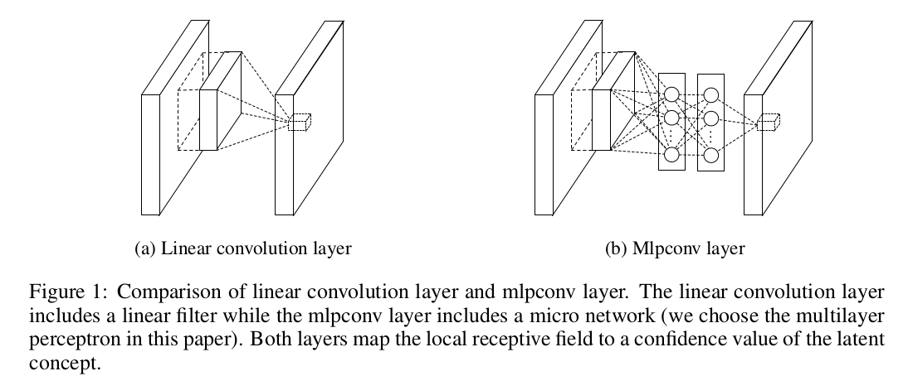
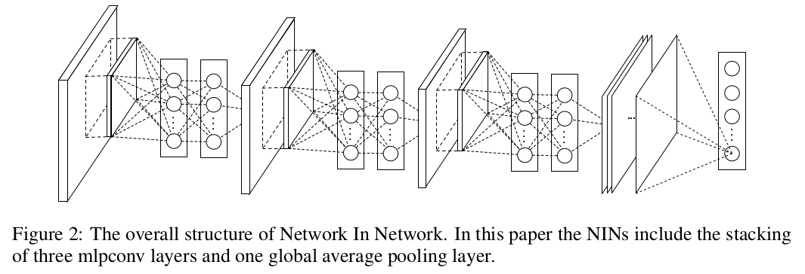

文章[Network In Network](https://arxiv.org/abs/1312.4400v3)提出一种新的深度网络结构`mlpconv`，使用微卷积网络（`micro neural network`）代替传统卷积层的线性滤波器，同时利用全局平均池化（`global average pooling`）代替全连接层作为分类器，在当时的`CIFAR-10`和`CIFAR-100`上实现了最好的检测结果

## 多层感知器池化层

### 传统卷积层

传统卷积层执行滤波器和局部感受野的内积操作（`inner product`），随后执行非线性激活函数，输出的结果称为特征图（`feature map`）。实现如下：

$$
f_{i,j,k} = \max (w_{k}^{T}x_{i,j}, 0)
$$

$(i,j)$表示特征图坐标，$x_{i,j}$表示输入数据体中以$(i,j)$为中心的局部数据块，$k$表示特征图的通道下标

卷积层滤波器是一个线性模型（`generalized linear model，GLM`），仅在输入数据是线性可分的情况下，`GLM`才能得到很好的抽象结果

为了能够在高度非线性数据中获取正确抽象信息，卷积层使用了过完备（`over-complete`）的滤波器，以此来涵盖所有潜在的变化，这会加重下一层滤波器的负担

### Maxout Network

`Maxout`网络在特征图上执行最大池化操作，其操作作为分段线性逼近器（`piecewise linear approximator`）能够近似所有的凸函数（`approximating any convex functions`）

`Maxout`网络的缺陷在于它依赖于输入空间是一个凸集

### MLPConv

径向机网络（`radial basis network`）和多层感知器（`multilayer perceptron，MLP`）是已知通用的函数逼近器（`universal function approximators`），`MLPConv`使用了`MLP`作为滤波器，有以下理由：

1. `MLP`兼容于卷积神经网络结构，比如反向传播训练
2. `MLP`同样是一个深度模型，符合特征重用精神（`the spirit of feature re-use`）

`MLPConv`结构如下

计算公式如下：

$$
f^{(1)}_{i,j,k_{1}} = \max ((w^{(1)}_{k_{1}})^{T}x_{i,j}+b_{k_{1}}, 0)\\
...\\
f^{(n)}_{i,j,k_{n}} = \max ((w^{(n)}_{k_{n}})^{T}x_{i,j}+b_{k_{n}}, 0)
$$

$n$表示`MLP`层数，在`MLP`的每层操作完成后使用`ReLU`作为激活函数

从跨通道（跨特征图）的角度来看，上式等同于在卷积层中执行**级联**跨通道参数池化（`cascaded cross channel parameteric pooling`）操作，每个跨通道参数池化层对输入特征图执行权重线性重组

单个`MLPConv`操作等同于级联多个跨通道参数池化层，这种级联的跨通道参数池化结构允许跨通道信息的交互学习

*从实现上看，单个跨通道参数池化层等同于1x1卷积核大小的传统卷积层操作*

## 全局平均池化层

传统神经网络中，使用卷积神经网络作为特征提取器，使用全连接层作为分类器，很难解释全连接层中发生的变化

使用全局平均池化层（`global average pooling layer, GAP`）替代全连接层作为分类器有以下优势：

1. 有很好的可解释性，它强制了特征映射和类别之间的对应，特征图可以解释为类别置信图
2. 全连接层易于过拟合，强烈依赖于正则化策略，而GAP是一个天然的正则化器（没有参数），能够避免过拟合
3. `GAP`求和了空间信息，对于输入数据的空间转换有更好的鲁棒性

`GAP`计算：最后一个`MLPConv`的特征块作为`GAP`的输入，通过空间平均特征图得到二维结果特征图，将结果特征图向量化后作为输出直接输入到`softmax`分类器

## NIN

文章提出新的网络模型`NIN`（`Network In Network`），底层使用多个`MLPConv`堆叠，顶层使用`GAP`和`softmax`分类器

### 模型细节

文章给出的模型内容

* 共`3`个`MLPConv`，每个`MLPConv`使用一个`3`层`MLP`

* 每个`MLPConv`后接一个`Max`池化层，步长为`2`

* 模型最后是一个`GAP`和`softmax`分类器

* 随机失活操作作用于前`2`个`MLPConv`的输出

参考[Network-in-Network Implementation using TensorFlow](https://embedai.wordpress.com/2017/07/23/network-in-network-implementation-using-tensorflow/)的实现细节如下：

*具体实现根据数据集进行调整*