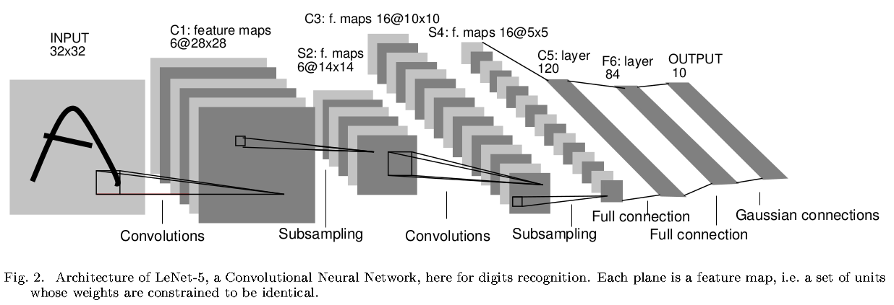

参考：

[神经网络推导-矩阵计算](https://www.zhujian.tech/posts/1dd3ebad.html#more)

[神经网络实现-numpy](https://www.zhujian.tech/posts/ba2ca878.html#more)

以`LeNet-5`为例，进行卷积神经网络的矩阵推导

## 计算符号

参考[lecun-98](https://link.zhihu.com/?target=http%3A//yann.lecun.com/exdb/publis/pdf/lecun-98.pdf)，卷积层标记为$Cx$，池化层标记为$Sx$，全连接层标记为$Fx$，比如$C1$表示第一层是卷积层

## `LeNet-5`简介

`LeNet-5`共有`7`层（不包含输入层）

* $C1$有`6`个滤波器，感受野尺寸为$5\times 5$，步长为$1$，零填充为$0$，所以$C1$共有$5\cdot 5\cdot 6+6=156$个训练参数，输出激活图尺寸为$28\times 28$

* $S2$感受野大小为$2\times 2$，步长为$2$，将输入数据体4个神经元相加后乘以一个可训练参数，再加上一个偏置值，最后进行$sigmoid$操作，所以$S2$共有$2\times 6=12$个训练参数，输出激活图尺寸为$14\times 14$

* $C3$有`16`个滤波器，感受野尺寸为$5\times 5$，步长为$1$, 零填充为$0$，所以输出激活图尺寸为$10\times 10$
    * $C3$的滤波器没有和$S2$完全连接：前6个滤波器和$S2$连续的3个激活图交互，接下来6个滤波器和$S2$连续的4个激活图交互，接下来3个滤波器和$S2$不连续的4个激活图交互，最后一个滤波器和$S2$全连接
    * $C3$的参数个数是$(5\cdot 5)\cdot (3\cdot 6+4\cdot 6+4\cdot 3+6\cdot 1)+16=1516$

* $S4$和$S2$一样，所以共有$2\times 16=32$个可学习参数，输出激活图尺寸为$5\times 5$

* $C5$有`120`个滤波器，感受野大小为$5\times 5$，步长为$1$，零填充为$0$，所以$C5$共有$5\cdot 5\cdot 16\cdot 120+120=48120$个参数，输出激活图尺寸为$1\times 1$，输出大小为$1\times 1\times 120$

* $F6$有`84`个神经元，激活函数是$tanh$，参数个数是$120\times 84+84=10164$个训练参数

* $F7$有`10`个神经元，得到84个输入后，不再执行点积运算，而是执行欧氏径向基函数（euclidean radial basis function）：
    $$
    y_{i}=\sum_{j}(x_{i}-w_{ij})^{2}
    $$

* 损失函数是均方误差（`Mean Squared Error, MSE`）

最早的`LeNet-5`在`1998`年提出，经过多年发展，一些实现细节发生了变化，其中一个版本如下

* $C1$有`6`个滤波器，感受野尺寸为$5\times 5$，步长为$1$，零填充为$0$，激活函数是$relu$，所以$C1$共有$5\cdot 5\cdot 6+6=156$个训练参数，输出激活图尺寸为$28\times 28$

* $S2$感受野大小为$2\times 2$，步长为$2$，使用$\max$运算，所以输出激活图尺寸为$14\times 14$

* $C3$有`16`个滤波器，感受野尺寸为$5\times 5$，步长为$1$, 零填充为$0$，激活函数是$relu$，所以$C3$参数个数是$5\cdot 5\cdot 6\cdot 16+16=2416$，输出激活图尺寸为$10\times 10$

* $S4$和$S2$一样，步长为$2$，使用$\max$运算，所以输出激活图尺寸为$5\times 5$

* $C5$有`120`个滤波器，感受野大小为$5\times 5$，步长为$1$，零填充为$0$，激活函数为$relu$，所以$C5$共有$5\cdot 5\cdot 16\cdot 120+120=48120$，输出激活图尺寸为$1\times 1$，输出大小为$1\times 120$

* $F6$有`84`个神经元，激活函数是$relu$，参数个数是$120\times 84+84=10164$个训练参数，输出大小为$1\times 84$

* $F7$有`10`个神经元，参数个数是$84\times 10+10=850$个，输出大小为$1\times 10$

* 评分函数使用$softmax$

* 损失函数是交叉熵损失（`Cross Entropy Loss`）

|    |   输入   | 卷积核 | 步长 | 零填充 |   输出   |
|:--:|:--------:|:------:|:----:|:------:|:--------:|
| C1 |  32x32x3 |   5x5  |   1  |    0   |  28x28x6 |
| S2 |  28x28x6 |   2x2  |   2  |    \   |  14x14x6 |
| C3 |  14x14x6 |   5x5  |   1  |    0   | 10x10x16 |
| S4 | 10x10x16 |   2x2  |   2  |    \   |  5x5x16  |
| C5 |  5x5x16  |   120  |   0  |    0   |   1x120  |
| F6 |  1x120   |   84   |   \  |    \   |  1x84    |
| F7 |  1x84    |   10   |   \  |    \   |  1x10    |

## 卷积层转全连接层

参考：[Implementation as Matrix Multiplication](http://cs231n.github.io/convolutional-networks/#fc)

卷积层滤波器在输入数据体的局部区域执行点积操作，将每次局部连接数据体拉伸为行向量，那么卷积操作就等同于矩阵乘法，变成全连接层运算

比如输入图像大小为$32\times 32\times 3$，卷积层滤波器大小为$5\times 5\times 3$，步长为$1$，零填充为$0$，共有6个

那么等同于全连接层的输入维度为$5\cdot 5\cdot 3=125$，共有$((32-5)/1+1)=784$个局部连接，所以矩阵运算如下：

$$
X\in R^{784\times 125}\\
W\in R^{125\times 6}\\
b\in R^{1\times 6}\\
Y=X\cdot W+B\in R^{784\times 6}
$$

得到输出数据$Y$后再拉伸回$55\times 55\times 6$，就是下一层的输入数据体

## 池化层转全连接层

池化层滤波器在输入数据体的激活图上执行$\max$操作，将每次局部连接区域拉伸为行向量，同样可以将池化层操作转换成全连接层操作

比如输入数据体大小为$28\times 28\times 6$，池化层滤波器空间尺寸$2\times 2$，步长为$2$

那么每次连接的向量大小是$2\cdot 2=4$，每个激活图共有$(28/2)^{2}=196$次局部连接，整个输入数据体共有$196\cdot 6=1176$次局部连接，所以运算如下：

$$
X\in R^{1176\times 4}\\
Y = \max(X)\in R^{1176\times 1}
$$

得到输出数据$Y$后再拉伸回$14\times 14\times 6$，就是下一层的输入数据体

## 矩阵计算

进行MNIST数据集的分类

### 前向传播

**输入层**

$$
X\in R^{32\times 32\times 1}
$$

**卷积层$C1$**

共6个滤波器，每个滤波器空间尺寸为$5\times 5$，步长为$1$, 零填充为$0$

输出空间尺寸为$(32-5-2\cdot 0)/1+1=28$

所以单次卷积操作的向量大小为$5\cdot 5\cdot 1=25$，单个滤波器有$28\cdot 28=784$个局部连接

$$
a^{(0)}\in R^{784\times 25}\\
W^{(1)}\in R^{25\times 6}\\
b^{(1)}\in R^{1\times 6}\\
\Rightarrow z^{(1)}=a^{(0)}\cdot W^{(1)}+b^{(1)}\in R^{784\times 6}\\
\Rightarrow y^{(1)}=relu(z^{(1)})\\
$$

输出数据体$output^{(1)}\in R^{28\times 28\times 6}$

**池化层$S2$**

执行$\max$运算，每个滤波器空间尺寸$2\times 2$，步长为$2$

输出空间尺寸为$(28-2)/2+1=14$

所以单次$\max$操作的向量大小为$2\cdot 2=4$，单个滤波器有$14\cdot 14\cdot 6=1176$个局部连接

$$
a^{(1)}\in R^{1176\times 4}\\
z^{(2)}=\max (a^{(1)})\in R^{1176\times 1}
$$

$argz^{(2)} = argmax(a^{(1)})\in R^{1176}$，每个值表示$a^{(1)}$中每行最大值下标

输出数据体$output^{(2)}\in R^{14\times 14\times 6}$

**卷积层$C3$**

共16个滤波器，每个滤波器空间尺寸为$5\times 5$，步长为$1$, 零填充为$0$

输出空间尺寸为$(14-5+2\cdot 0)/1+1=10$

所以单次卷积操作的向量大小为$5\cdot 5\cdot 6=150$，单个滤波器有$10\cdot 10=100$个局部连接

$$
a^{(2)}\in R^{100\times 150}\\
W^{(3)}\in R^{150\times 16}\\
b^{(3)}\in R^{1\times 16}\\
\Rightarrow z^{(3)}=a^{(2)}\cdot W^{(3)}+b^{(3)}\in R^{100\times 16}\\
\Rightarrow y^{(3)}=relu(z^{(3)})\\
$$

输出数据体$output^{(3)}\in R^{10\times 10\times 16}$

**池化层$S4$**

执行$\max$运算，每个滤波器空间尺寸$2\times 2$，步长为$2$

输出空间尺寸为$(10-2)/2+1=5$

所以单次$\max$操作的向量大小为$2\cdot 2=4$，单个滤波器有$5\cdot 5\cdot 16=400$个局部连接

$$
a^{(3)}\in R^{400\times 4}\\
z^{(4)}=\max (a^{(3)})\in R^{400\times 1}
$$

$argz^{(4)} = argmax(a^{(3)})\in R^{400}$，每个值表示$a^{(3)}$中每行最大值下标

输出数据体$output^{(4)}\in R^{5\times 5\times 16}$

**卷积层$C5$**

共120个滤波器，每个滤波器空间尺寸为$5\times 5$，步长为$1$, 零填充为$0$

输出空间尺寸为$(5-5+2\cdot 0)/1+1=1$

所以单次卷积操作的向量大小为$5\cdot 5\cdot 16=400$，单个滤波器有$1\cdot 1=1$个局部连接

$$
a^{(4)}\in R^{1\times 400}\\
W^{(5)}\in R^{400\times 120}\\
b^{(5)}\in R^{1\times 120}\\
\Rightarrow z^{(5)}=a^{(4)}\cdot W^{(5)}+b^{(5)}\in R^{1\times 120}\\
\Rightarrow y^{(5)}=relu(z^{(5)})\\
$$

输出数据体$output^{(5)}\in R^{1\times 120}$

**全连接层$F6$**

神经元个数为$84$

$$
a^{(5)}=y^{(5)}\in R^{1\times 120}\\
W^{(6)}\in R^{120\times 84}\\
b^{(6)}\in R^{1\times 84}\\
\Rightarrow z^{(6)}=a^{(5)}\cdot W^{(6)}+b^{(6)}\in R^{1\times 84}\\
\Rightarrow y^{(6)}=relu(z^{(6)})\\
$$

输出数据体$output^{(6)}\in R^{1\times 84}$

**输出层$F7$**

神经元个数为$10$

$$
a^{(6)}=y^{(6)}\in R^{1\times 84}\\
W^{(7)}\in R^{84\times 10}\\
b^{(7)}\in R^{1\times 10}\\
\Rightarrow z^{(7)}=a^{(6)}\cdot W^{(7)}+b^{(7)}\in R^{1\times 10}\\
$$

输出数据体$output^{(7)}\in R^{1\times 10}$

**分类概率**

$$
probs=h(z^{(7)})=\frac {exp(z^{(7)})}{exp(z^{(7)})\cdot A\cdot B^{T}}
$$

**$A\in R^{10\times 1}, B\in R^{10\times 1}$都是全$1$向量**

**损失值**

$$
dataLoss = -\frac {1}{N} 1^{T}\cdot \ln \frac {exp(z^{(7)}* Y\cdot A)}{exp(z^{(7)})\cdot A}
$$

$$
regLoss = 0.5\cdot reg\cdot (||W^{(1)}||^{2} + ||W^{(3)}||^{2} + ||W^{(5)}||^{2} + ||W^{(6)}||^{2} + ||W^{(7)}||^{2})
$$

$$
J(z^{(7)})=dataLoss + regLoss
$$

**$Y\in R^{1\times 10}$，仅有正确类别为`1`, 其余为`0`**

### 反向传播

**输出层$F7$**

求输入向量$z^{(7)}$梯度

$$
d(dataloss)=d(1^{T}\cdot \ln \frac {exp(z^{(7)}* Y\cdot A)}{exp(z^{(7)})\cdot A})=tr((probs^{T} - Y^{T})\cdot dz^{(7)})
$$

$$
\Rightarrow D_{z^{(7)}}f(z^{(7)})=probs^{T} - Y^{T}\\
\Rightarrow \bigtriangledown_{z^{(7)}}f(z^{(7)})=probs - Y
$$

其他梯度

$$
z^{(7)}=a^{(6)}\cdot W^{(7)}+b^{(7)} \\
dz^{(7)}=da^{(6)}\cdot W^{(7)} + a^{(6)}\cdot dW^{(7)} + db^{(7)}\\
d(dataloss)=tr(D_{z^{(7)}}f(z^{(7)})\cdot dz^{(7)})\\
=tr(D_{z^{(7)}}f(z^{(7)})\cdot (da^{(6)}\cdot W^{(7)} + a^{(6)}\cdot dW^{(7)} + db^{(7)}))\\
=tr(D_{z^{(7)}}f(z^{(7)})\cdot da^{(6)}\cdot W^{(7)})
+tr(D_{z^{(7)}}f(z^{(7)})\cdot a^{(6)}\cdot dW^{(7)})
+tr(D_{z^{(7)}}f(z^{(7)})\cdot db^{(7)}))
$$

求权重矩阵$W^{(7)}$梯度

$$
d(dataloss)=tr(D_{z^{(7)}}f(z^{(7)})\cdot a^{(6)}\cdot dW^{(7)})
$$

$$
\Rightarrow D_{W^{(7)}}f(W^{(7)})=D_{z^{(7)}}f(z^{(7)})\cdot a^{(6)}\\
\Rightarrow \bigtriangledown_{W^{(7)}}f(W^{(7)})=(a^{(6)})^{T}\cdot \bigtriangledown_{z^{(7)}}f(z^{(7)})
$$

求偏置向量$b^{(7)}$梯度

$$
d(dataloss)=tr(D_{z^{(7)}}f(z^{(7)})\cdot db^{(7)}))
$$

$$
\Rightarrow D_{b^{(7)}}f(b^{(7)})=D_{z^{(7)}}f(z^{(7)})\\
\Rightarrow \bigtriangledown_{b^{(7)}}f(b^{(7)})=\bigtriangledown_{z^{(7)}}f(z^{(7)})
$$

求上一层输出向量$a^{(6)}$梯度

$$
d(dataloss)=tr(D_{z^{(7)}}f(z^{(7)})\cdot da^{(6)}\cdot W^{(7)})
=tr(W^{(7)}\cdot D_{z^{(7)}}f(z^{(7)})\cdot da^{(6)})
$$

$$
\Rightarrow D_{a^{(6)}}f(a^{(6)})=W^{(7)}\cdot D_{z^{(7)}}f(z^{(7)})\\
\Rightarrow \bigtriangledown_{a^{(6)}}f(a^{(6)})=\bigtriangledown_{z^{(7)}}f(z^{(7)})\cdot (W^{(7)})^{T}
$$

**全连接层$F6$**

求输入向量$z^{(6)}$梯度

$$
a^{(6)}=y^{(6)}=relu(z^{(6)})\\
da^{(6)}=1(z^{(6)}\geq 0)* dz^{(6)}
$$

$$
d(dataloss)=tr(D_{a^{(6)}}f(a^{(6)}) da^{(6)})=tr(D_{a^{(6)}}f(a^{(6)})\cdot (1(z^{(6)}\geq 0)* dz^{(6)}))\\
=tr(D_{a^{(6)}}f(a^{(6)})* 1(z^{(6)}\geq 0)^{T}\cdot dz^{(6)})
$$

$$
\Rightarrow D_{z^{(6)}}f(z^{(6)})=D_{a^{(6)}}f(a^{(6)})* 1(z^{(6)}\geq 0)^{T}\\
\Rightarrow \bigtriangledown_{z^{(6)}}f(z^{(6)})=\bigtriangledown_{a^{(6)}}f(a^{(6)})* 1(z^{(6)}\geq 0)
$$

其他梯度

$$
z^{(6)}=a^{(5)}\cdot W^{(6)}+b^{(6)} \\
dz^{(6)}=da^{(5)}\cdot W^{(6)}+a^{(5)}\cdot dW^{(6)}+db^{(6)}\\
d(dataloss)=tr(D_{z^{(6)}}f(z^{(6)})\cdot dz^{(6)})\\
=tr(D_{z^{(6)}}f(z^{(6)})\cdot (da^{(5)}\cdot W^{(6)} + a^{(5)}\cdot dW^{(6)} + db^{(6)}))\\
=tr(D_{z^{(6)}}f(z^{(6)})\cdot da^{(5)}\cdot W^{(6)})
+tr(D_{z^{(6)}}f(z^{(6)})\cdot a^{(5)}\cdot dW^{(6)})
+tr(D_{z^{(6)}}f(z^{(6)})\cdot db^{(6)}))
$$

求权重矩阵$w^{(6)}$梯度

$$
d(dataloss)=tr(D_{z^{(6)}}f(z^{(6)})\cdot a^{(5)}\cdot dW^{(6)})
$$

$$
\Rightarrow D_{W^{(6)}}f(W^{(6)})=D_{z^{(6)}}f(z^{(6)})\cdot a^{(5)}\\
\Rightarrow \bigtriangledown_{W^{(6)}}f(W^{(6)})=(a^{(5)})^{T}\cdot \bigtriangledown_{z^{(6)}}f(z^{(6)})
$$

求偏置向量$b^{(6)}$梯度

$$
d(dataloss)=tr(D_{z^{(6)}}f(z^{(6)})\cdot db^{(6)}))
$$

$$
\Rightarrow D_{b^{(6)}}f(b^{(6)})=D_{z^{(6)}}f(z^{(6)})\\
\Rightarrow \bigtriangledown_{b^{(6)}}f(b^{(6)})=\bigtriangledown_{z^{(6)}}f(z^{(6)})
$$

$N$表示$dz^{(7)}$的行数

求上一层输出向量$a^{(5)}$梯度

$$
d(dataloss)=tr(D_{z^{(6)}}f(z^{(6)})\cdot da^{(5)}\cdot W^{(6)})
=tr(W^{(6)}\cdot D_{z^{(6)}}f(z^{(6)})\cdot da^{(5)})
$$

$$
\Rightarrow D_{a^{(5)}}f(a^{(5)})=W^{(6)}\cdot D_{z^{(6)}}f(z^{(6)})\\
\Rightarrow \bigtriangledown_{a^{(5)}}f(a^{(5)})=\bigtriangledown_{z^{(6)}}f(z^{(6)})\cdot (W^{(6)})^{T}
$$

**卷积层$C5$**

求输入向量$z^{(5)}$梯度

$$
a^{(5)}=y^{(5)}=relu(z^{(5)})\\
da^{(5)}=1(z^{(5)}\geq 0)* dz^{(5)}\\
$$

$$
d(dataloss)=tr(D_{a^{(5)}}f(a^{(5)}) da^{(5)})=tr(D_{a^{(5)}}f(a^{(5)})\cdot (1(z^{(5)}\geq 0)* dz^{(5)}))\\
=tr(D_{a^{(5)}}f(a^{(5)})* 1(z^{(5)}\geq 0)^{T}\cdot dz^{(5)})
$$

$$
\Rightarrow D_{z^{(5)}}f(z^{(5)})=D_{a^{(5)}}f(a^{(5)})* 1(z^{(5)}\geq 0)^{T}\\
\Rightarrow \bigtriangledown_{z^{(5)}}f(z^{(5)})=\bigtriangledown_{a^{(5)}}f(a^{(5)})* 1(z^{(5)}\geq 0)
$$

其他梯度

$$
z^{(5)}=a^{(4)}\cdot W^{(5)}+b^{(5)} \\
dz^{(5)}=da^{(4)}\cdot W^{(5)}+a^{(4)}\cdot dW^{(5)}+db^{(5)}\\
d(dataloss)=tr(D_{z^{(5)}}f(z^{(5)})\cdot dz^{(5)})\\
=tr(D_{z^{(5)}}f(z^{(5)})\cdot (da^{(4)}\cdot W^{(5)} + a^{(4)}\cdot dW^{(5)} + db^{(5)}))\\
=tr(D_{z^{(5)}}f(z^{(5)})\cdot da^{(4)}\cdot W^{(5)})
+tr(D_{z^{(5)}}f(z^{(5)})\cdot a^{(4)}\cdot dW^{(5)})
+tr(D_{z^{(5)}}f(z^{(5)})\cdot db^{(5)}))
$$

求权重矩阵$W^{(5)}$梯度

$$
d(dataloss)=tr(D_{z^{(5)}}f(z^{(5)})\cdot a^{(4)}\cdot dW^{(5)})
$$

$$
\Rightarrow D_{W^{(5)}}f(W^{(5)})=D_{z^{(5)}}f(z^{(5)})\cdot a^{(4)}\\
\Rightarrow \bigtriangledown_{W^{(5)}}f(W^{(5)})=(a^{(4)})^{T}\cdot \bigtriangledown_{z^{(5)}}f(z^{(5)})
$$

求偏置向量$b^{(5)}$梯度

$$
d(dataloss)=tr(D_{z^{(5)}}f(z^{(5)})\cdot db^{(5)})
$$

$$
\Rightarrow D_{b^{(5)}}f(b^{(5)})=D_{z^{(5)}}f(z^{(5)})\\
\Rightarrow \bigtriangledown_{b^{(5)}}f(b^{(5)})=\bigtriangledown_{z^{(5)}}f(z^{(5)})
$$

求上一层输出向量$a^{(4)}$梯度

$$
d(dataloss)=tr(D_{z^{(5)}}f(z^{(5)})\cdot da^{(4)}\cdot W^{(5)})
=tr(W^{(5)}\cdot D_{z^{(5)}}f(z^{(5)})\cdot da^{(4)})
$$

$$
\Rightarrow D_{a^{(4)}}f(a^{(4)})=W^{(5)}\cdot D_{z^{(5)}}f(z^{(5)})\\
\Rightarrow \bigtriangledown_{a^{(4)}}f(a^{(4)})=\bigtriangledown_{z^{(5)}}f(z^{(5)})\cdot (W^{(5)})^{T}
$$

**池化层$S4$**

将$a^{(4)}$梯度重置回$output^{(4)}$梯度，再重置为$y^{(4)}$梯度

因为卷积层$C5$滤波器的空间尺寸和$output^{(4)}$的空间尺寸一致，所以不需要将$a^{(4)}$先转换成$output^{(4)}$，再转换成$y^{(4)}$，可以一步到位

求输入向量$z^{(4)}$梯度

$$
z^{(4)}\in R^{400\times 1},\ a^{(4)}\in R^{1\times 400}\\
\Rightarrow a^{(4)} = (z^{(4)})^{T}\\
\Rightarrow da^{(4)} = d(z^{(4)})^{T}
$$

$$
d(dataloss)=tr(D_{a^{(4)}}f(a^{(4)}) da^{(4)})=tr(D_{a^{(4)}}f(a^{(4)})\cdot d(z^{(4)})^{T})\\
=tr(D_{a^{(4)}}f(a^{(4)})^{T}\cdot dz^{(4)})
$$

$$
\Rightarrow D_{z^{(4)}}f(z^{(4)})=D_{a^{(4)}}f(a^{(4)})^{T}\\
\Rightarrow \bigtriangledown_{z^{(4)}}f(z^{(4)})=D_{a^{(4)}}f(a^{(4)})
$$

上一层输出向量$a^{(3)}$梯度

$$
z^{(4)}=\max (a^{(3)})\\
dz^{(4)}=1(a^{(3)}\ is\ the\ max)* da^{(3)}
$$

配合$argz^{(4)}$，最大值梯度和$z^{(4)}$一致，其余梯度为$0$

$$
d(dataloss)=tr(D_{z^{(4)}}f(z^{(4)}) dz^{(4)})\\
=tr(D_{z^{(4)}}f(z^{(4)})\cdot 1(a^{(3)}\ is\ the\ max)* da^{(3)})
=tr(D_{z^{(4)}}f(z^{(4)})* 1(a^{(3)}\ is\ the\ max)^{T}\cdot da^{(3)}
$$

$$
\Rightarrow D_{a^{(3)}}f(a^{(3)})=D_{z^{(4)}}f(z^{(4)})* 1(a^{(3)}\ is\ the\ max)^{T}\\
\Rightarrow \bigtriangledown_{a^{(3)}}f(a^{(3)})=\bigtriangledown_{z^{(4)}}f(z^{(4)})* 1(a^{(3)}\ is\ the\ max)
$$

**卷积层$C3$**

将$a^{(3)}$梯度重置回$output^{(3)}$梯度，再重置为$y^{(3)}$梯度

求输入向量$z^{(3)}$梯度

$$
y^{(3)} = relu(z^{(3)})\\
dy^{(3)} = 1(z^{(3)} \geq 0)*dz^{(3)}
$$

$$
d(dataloss)
=tr(D_{y^{(3)}}f(y^{(3)})\cdot dy^{(3)})\\
=tr(D_{y^{(3)}}f(y^{(3)})\cdot (1(z^{(3)} \geq 0)*dz^{(3)}))\\
=tr(D_{y^{(3)}}f(y^{(3)})* 1(z^{(3)} \geq 0)^{T}\cdot dz^{(3)})
$$

$$
\Rightarrow D_{z^{(3)}}f(z^{(3)})=D_{y^{(3)}}f(y^{(3)})* 1(z^{(3)} \geq 0)^{T}\\
\Rightarrow \bigtriangledown_{z^{(3)}}f(z^{(3)})=\bigtriangledown_{y^{(3)}}f(y^{(3)})* 1(z^{(3)} \geq 0)
$$

其他梯度

$$
z^{(3)}=a^{(2)}\cdot W^{(3)}+b^{(3)} \\
dz^{(3)}=da^{(2)}\cdot W^{(3)}+a^{(2)}\cdot dW^{(3)}+db^{(3)}\\
d(dataloss)=tr(D_{z^{(3)}}f(z^{(3)})\cdot dz^{(3)})\\
=tr(D_{z^{(3)}}f(z^{(3)})\cdot (da^{(2)}\cdot W^{(3)} + a^{(2)}\cdot dW^{(3)} + db^{(3)}))\\
=tr(D_{z^{(3)}}f(z^{(3)})\cdot da^{(2)}\cdot W^{(3)})
+tr(D_{z^{(3)}}f(z^{(3)})\cdot a^{(2)}\cdot dW^{(3)})
+tr(D_{z^{(3)}}f(z^{(3)})\cdot db^{(3)}))
$$

求权重矩阵$W^{(3)}$梯度

$$
d(dataloss)=tr(D_{z^{(3)}}f(z^{(3)})\cdot a^{(2)}\cdot dW^{(3)})
$$

$$
\Rightarrow D_{W^{(3)}}f(W^{(3)})=D_{z^{(3)}}f(z^{(3)})\cdot a^{(2)}\\
\Rightarrow \bigtriangledown_{W^{(3)}}f(W^{(3)})=(a^{(2)})^{T}\cdot \bigtriangledown_{z^{(3)}}f(z^{(3)})
$$

求偏置向量$b^{(3)}$梯度

$$
d(dataloss)=\frac {1}{N} \sum_{i=1}^{N} tr(D_{z^{(3)}}f(z^{(3)})\cdot db^{(3)})
$$

$$
\Rightarrow D_{b^{(3)}}f(b^{(3)})=\frac {1}{N} \sum_{i=1}^{N} D_{z^{(3)}}f(z^{(3)})\\
\Rightarrow \bigtriangledown_{b^{(3)}}f(b^{(3)})=\frac {1}{N} \sum_{i=1}^{N} \bigtriangledown_{z^{(3)}}f(z^{(3)})
$$

$N$表示$dz^{(3)}$的行数

求上一层输出向量$a^{(2)}$梯度

$$
d(dataloss)=tr(D_{z^{(3)}}f(z^{(3)})\cdot da^{(2)}\cdot W^{(3)})
=tr(W^{(3)}\cdot D_{z^{(3)}}f(z^{(3)})\cdot da^{(2)})
$$

$$
\Rightarrow D_{a^{(2)}}f(a^{(2)})=W^{(3)}\cdot D_{z^{(3)}}f(z^{(3)})\\
\Rightarrow \bigtriangledown_{a^{(2)}}f(a^{(2)})=\bigtriangledown_{z^{(3)}}f(z^{(3)})\cdot (W^{(3)})^{T}
$$

**池化层$S2$**

$C3$输入层梯度大小为$100\times 150$，是在$S2$输出数据体$output^{(2)}$上采样获得，将$da^{(2)}$重采样回$output^{(2)}$梯度矩阵，再重置回$1176\times 1$大小，就是$z^{(2)}$的梯度

上一层输出向量$a^{(1)}$梯度

$$
z^{(2)}=\max (a^{(1)})\\
dz^{(2)}=1(a^{(1)}\ is\ the\ max)* da^{(1)}
$$

配合$argz^{(2)}$，最大值梯度和$z^{(2)}$一致，其余梯度为$0$

$$
d(dataloss)=tr(D_{z^{(2)}}f(z^{(2)}) dz^{(2)})\\
=tr(D_{z^{(2)}}f(z^{(2)})\cdot 1(a^{(1)}\ is\ the\ max)* da^{(1)})
=tr(D_{z^{(2)}}f(z^{(2)})* 1(a^{(1)}\ is\ the\ max)^{T}\cdot da^{(1)}
$$

$$
\Rightarrow D_{a^{(1)}}f(a^{(1)})=D_{z^{(2)}}f(z^{(2)})* 1(a^{(1)}\ is\ the\ max)^{T}\\
\Rightarrow \bigtriangledown_{a^{(1)}}f(a^{(1)})=\bigtriangledown_{z^{(2)}}f(z^{(2)})* 1(a^{(1)}\ is\ the\ max)
$$

**卷积层$C1$**

将$a^{(1)}$梯度重置回$output^{(1)}$梯度，再重置为$y^{(1)}$梯度

求输入向量$z^{(1)}$梯度

$$
y^{(1)} = relu(z^{(1)})\\
dy^{(1)} = 1(z^{(1)} \geq 0)*dz^{(1)}
$$

$$
d(dataloss)
=tr(D_{y^{(1)}}f(y^{(1)})\cdot dy^{(1)})\\
=tr(D_{y^{(1)}}f(y^{(1)})\cdot (1(z^{(1)} \geq 0)*dz^{(1)}))\\
=tr(D_{y^{(1)}}f(y^{(1)})* 1(z^{(1)} \geq 0)^{T}\cdot dz^{(1)})
$$

$$
\Rightarrow D_{z^{(1)}}f(z^{(1)})=D_{y^{(1)}}f(y^{(1)})* 1(z^{(1)} \geq 0)^{T}\\
\Rightarrow \bigtriangledown_{z^{(1)}}f(z^{(1)})=\bigtriangledown_{y^{(1)}}f(y^{(1)})* 1(z^{(1)} \geq 0)
$$

其他梯度

$$
z^{(1)}=a^{(0)}\cdot W^{(1)}+b^{(1)} \\
dz^{(1)}=da^{(0)}\cdot W^{(1)}+a^{(0)}\cdot dW^{(1)}+db^{(1)}\\
d(dataloss)=tr(D_{z^{(1)}}f(z^{(1)})\cdot dz^{(1)})\\
=tr(D_{z^{(1)}}f(z^{(1)})\cdot (da^{(0)}\cdot W^{(1)} + a^{(0)}\cdot dW^{(1)} + db^{(1)}))\\
=tr(D_{z^{(1)}}f(z^{(1)})\cdot da^{(0)}\cdot W^{(1)})
+tr(D_{z^{(1)}}f(z^{(1)})\cdot a^{(0)}\cdot dW^{(1)})
+tr(D_{z^{(1)}}f(z^{(1)})\cdot db^{(1)}))
$$

求权重矩阵$W^{(1)}$梯度

$$
d(dataloss)=tr(D_{z^{(1)}}f(z^{(1)})\cdot a^{(0)}\cdot dW^{(1)})
$$

$$
\Rightarrow D_{W^{(1)}}f(W^{(1)})=D_{z^{(1)}}f(z^{(1)})\cdot a^{(0)}\\
\Rightarrow \bigtriangledown_{W^{(1)}}f(W^{(1)})=(a^{(0)})^{T}\cdot \bigtriangledown_{z^{(1)}}f(z^{(1)})
$$

求偏置向量$b^{(1)}$梯度

$$
d(dataloss)=\frac {1}{N} \sum_{i=1}^{N} tr(D_{z^{(1)}}f(z^{(1)})\cdot db^{(1)})
$$

$$
\Rightarrow D_{b^{(1)}}f(b^{(1)})=\frac {1}{N} \sum_{i=1}^{N} D_{z^{(1)}}f(z^{(1)})\\
\Rightarrow \bigtriangledown_{b^{(1)}}f(b^{(1)})=\frac {1}{N} \sum_{i=1}^{N} \bigtriangledown_{z^{(1)}}f(z^{(1)})
$$

$N$表示$dz^{(1)}$的行数