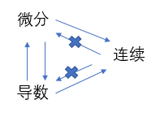
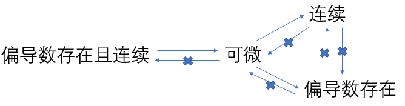

参考：

《高等数学》导数与微分

《高等数学》多元函数微分学

最近推导神经网络的前向传播和反向传播过程，经常会遇到有关导数、微分和梯度的内容，对它们的概念进行一次小结

* 导数
* 微分
* 偏导数
* 全微分
* 方向导数
* 梯度

## 导数

设函数$y=f(x)$在点$x_{0}$处的某个邻域$U(x_{0}, \delta)$内有定义，当自变量$x$在$x^{0}$处取得增量$\Delta x$（点$x+\Delta x$仍在该邻域内）时，相应地，函数$y=f(x)$取得增量$\Delta y=f(x_{0}+\Delta x)-f(x_{0})$，如果极限

$$
\lim_{\Delta x\to 0}\frac {\Delta y}{\Delta x}=
\lim_{\Delta x\to 0}\frac {\Delta f(x_{0}+\Delta x)-f(x_{0})}{\Delta x}
$$

存在，则称函数$y=f(x)$在点$x_{0}$处可导，并称这个极限值为函数$y=f(x)$在点$x_{0}$处的导数，记为

$$
{y}'|_{x=x_{0}},\ f'(x_{0}),\ \frac {dy}{dx}|_{x=x_{0}}\ 或\ \frac {df(x)}{dx}|_{x=x_{0}}
$$

即

$$
f'(x_{0})=
\lim_{\Delta x\to 0}\frac {\Delta y}{\Delta x}=
\lim_{\Delta x\to 0}\frac {\Delta f(x_{0}+\Delta x)-f(x_{0})}{\Delta x}
$$

函数$f(x)$在点$x_{0}$处可导有时也说成$f(x)$在点$x_{0}$具有导数或导数存在

如果极限不存在，则说$y=f(x)$在点$x_{0}$处不可导

### 不可导情形

1. 当$\Delta x\to 0$时，$\frac {\Delta y}{\Delta x}$没有稳定的变化趋势
2. $\lim_{\Delta x\to 0}\frac {\Delta y}{\Delta x}=\infty $，此时也说导数为无穷大

### 左导数和右导数

设函数$y=f(x)$在点$x_{0}$的某个右邻域$[x_{0},x_{0}+\delta)$内有定义，如果极限

$$
\lim_{\Delta x\to 0^{+}}\frac {\Delta f(x_{0}+\Delta x)-f(x_{0})}{\Delta x}\ 或\ 
\lim_{x\to x_{0}^{+}}\frac {f(x)-f(x_{0})}{x-x_{0}}
$$

存在，则称此极限为函数$f(x)$在点$x_{0}$处的**右导数**，记作$f'_{+}(x_{0})

设函数$y=f(x)$在点$x_{0}$的某个右邻域$[x_{0},x_{0}+\delta)$内有定义，如果极限

$$
\lim_{\Delta x\to 0^{-}}\frac {\Delta f(x_{0}+\Delta x)-f(x_{0})}{\Delta x}\ 或\ 
\lim_{x\to x_{0}^{-}}\frac {f(x)-f(x_{0})}{x-x_{0}}
$$

存在，则称此极限为函数$f(x)$在点$x_{0}$处的**左导数**，记作$f'_{-}(x_{0})$

函数$y=f(x)$在点$x_{0}$处可导的**充分必要条件**是左导数$f'_{-}(x_{0})$和右导数$f'_{+}(x_{0})$都存在且相等

### 可导性和连续性

函数连续只是函数可导的必要条件，但不是充分条件，所以如果函数在某点不连续，则函数在该点必不可导

**所以可导必连续，连续不一定可导，不连续一定不可导**

### 四则运算法则

* $[u(x)+v(x)]'=u'(x)\pm v'(x)$
* $[u(x)v(x)]'=u'(x)v(x)+u(x)v'(x)$
* $[\frac {u(x)}{v(x)}]'=\frac {u'(x)v(x)-u(x)v'(x)}{v^{2}(x)}$

## 微分

设函数$y=f(x)$在某个区间内有定义，$x_{0}$及$x_{0}+\Delta x$在这个区间内，如果函数的增量$\Delta y=f(x_{0}+\Delta x)-f(x_{0})$可表示为

$$
\Delta y=A\Delta x+o(\Delta x)
$$

其中$A$是与$\Delta x$无关的常数，$o(\Delta x)$是比$\Delta x$高阶的无穷小，则称函数$y=f(x)$在点$x_{0}$可微，称$A\Delta x$为函数$y=f(x)$在点$x_{0}$相应于自变量增量$\Delta x$的微分，记作$dy|_{x=x_{0}}$或$df(x)|_{x=x_{0}}$，即

$$
dy|_{x=x_{0}}=A\Delta x
$$

### 可微与可导

函数$y=f(x)$在点$x_{0}$处可微的充要条件是$f(x)$在点$x_{0}$处可导，且

$$
dy|_{x=x_{0}}=f'(x_{0})\Delta x
$$

**所以可微必可导，可导必可微，二者等价**

## 偏导数

设函数$z=f(x,y)$在点$(x_{0},y_{0})$的某一邻域内有定义，当$y$固定在$y_{0}$，而$x$在$x_{0}$处有增量$\Delta x$时，相应地函数有增量

$$
f(x_{0}+\Delta x, y)-f(x_{0},y_{0})
$$

如果

$$
\lim_{\Delta x\to 0}\frac {f(x_{0}+\Delta x, y_{0})-f(x_{0},y_{0})}{\Delta x}
$$

存在，则称此极限为函数$z=f(x,y)$在点$(x_{0},y_{0})$处对$x$的偏导数，记为

$$
\frac{\partial z}{\partial x}|_{x=x_{0},y=y_{0}}, \ 
\frac{\partial f}{\partial x}|_{x=x_{0},y=y_{0}}, \ 
z_{x}|_{x=x_{0},y=y_{0}}, \ 或\ f_{x}(x_{0},y_{0}) 
$$

类似地，函数$z=f(x,y)$在点$(x_{0},y_{0})$处对$y$的偏导数定义为

$$
\lim_{\Delta y\to 0}\frac {f(x_{0}, y_{0}+\Delta y)-f(x_{0},y_{0})}{\Delta y}
$$

记为

$$
\frac{\partial z}{\partial y}|_{x=x_{0},y=y_{0}}, \ 
\frac{\partial f}{\partial y}|_{x=x_{0},y=y_{0}}, \ 
z_{y}|_{x=x_{0},y=y_{0}}, \ 或\ f_{y}(x_{0},y_{0}) 
$$

**由偏导数的定义可知，求偏导数本质上是求一元函数的导数，函数对某一个变量求偏导数时，只需要把其余的自变量看成常数，因此一元函数微分法的求导法则全部适用于多元函数的偏导数**

## 全微分

设二元函数$z=f(x,y)$在点$(x,y)$的某领域内有定义且偏导数$f_{x}(x,y), f_{y}(x,y)$存在，当变量$x,y$分别有增量$\Delta x, \Delta y$时，由一元函数增量与微分的关系，得

$$
f(x+\Delta x,y)-f(x,y)\approx f_{x}(x,y)\Delta x \\
f(x,y+\Delta y)-f(x,y)\approx f_{y}(x,y)\Delta y
$$

其中

$$
f(x+\Delta x,y)-f(x,y), \ f(x,y+\Delta y)-f(x,y)
$$

分别成为二元函数对$x$和对$y$的**偏增量**，而

$$
f_{x}(x,y)\Delta x, \ f_{y}(x,y)\Delta y
$$

分别称为二元函数对$x$和对$y$的**偏微分**，将

$$
\Delta z=f(x+\Delta x,y+\Delta y)-f(x,y)
$$

称为函数$f(x,y)$在点$(x,y)$处的**全增量**

若函数$z=f(x,y)$在点$(x,y)$处的全增量可以表示为

$$
\Delta z=f(x+\Delta x,y+\Delta y)-f(x,y)
=A\Delta x+B\Delta y+o(\rho )
$$

其中，$A,B$不依赖于$\Delta x,\Delta y$，只与$x,y$有关，$\rho=\sqrt{(\Delta x)^{2}+(\Delta y)^{2}}$，$o(\rho )$是当$\rho \to 0$时比$\rho $高阶的无穷小量，则称函数$z=f(x,y)$在点$(x,y)$处**可微**，而称$A\Delta x+B\Delta y$为函数$z=f(x,y)$在点$(x,y)$处的**全微分**，记作

$$
dz = A\Delta x+B\Delta y
$$

### 全微分、偏导数与连续性

如果函数$z=f(x,y)$在点$(x,y)$处可微，则函数在该点连续

**所以连续是可微的必要条件，可微必连续**

如果函数$z=f(x,y)$在点$(x,y)$处的两个偏导数$\frac{\partial z}{\partial x}, \frac{\partial z}{\partial y}$存在且连续，则函数在该点可微

**所以偏导数存在且连续是可微的充分条件，可微必存在偏导数**

**偏导数和连续性没有关系**

## 方向导数

设函数$z=f(x,y)$在$P_{0}(x_{0},y_{0})$的某一领域$U(P_{0})$内有定义，自$P_{0}(x_{0},y_{0})$点引射线$l$，在$l$上任取一点$P(x_{0}+\Delta x,y_{0}+\Delta y),P\in U(P_{0})$

若$P$沿$l$趋近于$P_{0}$时，即当

$$
\rho =\sqrt{(\Delta x)^2+(\Delta y)^2} \to 0
$$

时，极限

$$
\lim_{\rho \to o^{+}}\frac {f(x_{0}+\Delta x,y_{0}+\Delta y)-f(x_{0},y_{0})}{\rho}
$$

存在，则称此极限为函数$f(x,y)$在点$P_{0}$处沿方向$l$的**方向导数**，记作$\frac{\partial f}{\partial l}|_{x=x_{0},y=y_{0}}$，即

$$
\frac{\partial f}{\partial l}|_{x=x_{0},y=y_{0}}=
\lim_{\rho \to o^{+}}\frac {f(x_{0}+\Delta x,y_{0}+\Delta y)-f(x_{0},y_{0})}{\rho}
$$

### 方向导数和偏导数

如果函数$z=f(x,y)$在点$P_{0}(x_{0},y_{0})$的偏导数存在，则**偏导数就是函数沿坐标轴正向的方向导数**

## 梯度

设函数$z=f(x,y)$在平面区域$D$内具有一阶**连续偏导数**，则对于每一点$P_{0}(x_{0},y_{0})\in D$都可确定一个向量

$$
f_{x}(x_{0},y_{0})i + f_{y}(x_{0},y_{0})j
$$

该向量称为函数$z=f(x,y)$在点$P_{0}(x_{0},y_{0})$的梯度，记作$grad f(x_{0},y_{0})$或$\bigtriangledown f(x_{0},y_{0})$，即

$$
grad f(x_{0},y_{0})=
f_{x}(x_{0},y_{0})i + f_{y}(x_{0},y_{0})j=
\{f_{x}(x_{0},y_{0}), f_{y}(x_{0},y_{0})\}
$$

### 梯度和方向导数

设$e_{l}=\{\cos \alpha,\cos \beta\}$是与方向$l$同方向的单位向量，则由方向导数的计算公式得

$$
\frac{\partial f}{\partial l}|_{x=x_{0},y=y_{0}}=
f_{x}(x_{0},y_{0})\cos \alpha+f_{y}(x_{0},y_{0})\cos \beta=
\{f_{x}(x_{0},y_{0}),f_{y}(x_{0},y_{0})\}\cdot \{ \cos \alpha, \cos \beta \}\\=
grad f(x_{0},y_{0})\cdot e_{l}=
|grad f(x_{0},y_{0})|\cos \theta
$$

当$\theta = 0$，即方向$e_{l}$与梯度$grad f(x_{0},y_{0})$的方向相同时，方向导数$\frac{\partial f}{\partial l}|_{x=x_{0},y=y_{0}}=$取得最大值，也就是函数$f(x,y)$增加得最快，这个最大值就是梯度$grad f(x_{0},y_{0})$的模，即$|grad f(x_{0},y_{0})|$

**所以梯度向量的方向是函数在该点的方向导数取得最大值的方向，梯度向量的模就是方向导数的最大值**

## 小结

1. 一元还是多元

    导数和微分是一元函数定义

    偏导数、全微分、方向导数和梯度是多元函数定义

2. 导数、微分和连续性关系

    导数和微分等价，可导必可微，可微必可导

    连续性是导数的必要关系，可导必连续，不连续必不可导

    

3. 偏导数、全微分和连续性关系

    偏导数、全微分和连续性没有等价关系

    连续性和偏导数存在是可微的充分条件

    连续性是可微的必要条件，可微必连续

    偏导数是可微的必要条件，可微必可偏导

    连续性和偏导数没有关系

    

4. 全微分、方向导数和梯度

    参考：

    [导数、微分、偏导数、全微分、方向导数、梯度的定义与关系](https://blog.csdn.net/czmacd/article/details/81178650)

    [梯度与全微分的关系是什么？梯度方向上的增量是全微分么？](https://www.zhihu.com/question/63660102/answer/259769616)

    全微分存在是方向导数存在的充分条件，全微分存在则方向导数存在

    梯度方向是方向导数取得最大变化的方向，梯度模就是最大变化值