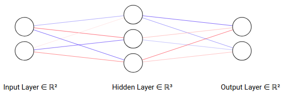

参考：

[神经网络概述](https://www.zhujian.tech/posts/7ca31f7.html#more)

[神经网络](http://ufldl.stanford.edu/wiki/index.php/%E7%A5%9E%E7%BB%8F%E7%BD%91%E7%BB%9C)

定义一个`2`层神经网络`TestNet`，结构如下：

* 输入层有`2`个神经元
* 隐藏层有`3`个神经元
* 输出层有`2`个神经元

* 激活函数为`sigmoid`函数
* 评分函数为`softmax`回归
* 代价函数为交叉熵损失

## 网络符号定义

规范神经网络的计算符号，以`TestNet`为例

关于神经元和层数

* $L$表示网络层数（不计入输入层）
    * $L=2$，其中输入层是第`0`层，隐藏层是第`1`层，输出层是第`2`层
* $n^{(l)}$表示第$l$层的神经元个数（不包括偏置神经元）
    * $n^{(0)}=2$，表示输入层神经元个数为`2`
    * $n^{(1)}=3$，表示隐藏层神经元个数为`3`
    * $n^{(2)}=2$，表示输出层神经元个数为`2`

关于权重矩阵和偏置值

* $W^{(l)}$表示第$l-1$层到第$l$层的**权重矩阵**，矩阵行数为第$l$层的神经元个数，列数为第$l-1$层神经元个数
    * $W^{(1)}$表示输入层到隐藏层的权重矩阵，大小为$3\times 2$
    * $W^{(2)}$表示隐藏层到输出层的权重矩阵，大小为$2\times 3$
* $W^{(l)}_{i}$表示第$l$层第$i$个神经元的权重向量，大小为$1\times n^{(l-1)}$
* $W^{(l)}_{i,j}$表示第$l-1$层第$j$个神经元到第$l$第$i$个神经元的权值
    * $i$的取值范围是$[1,n^{(l)}]$
    * $j$的取值范围是$[1, n^{(l-1)}]$
* $b^{(l)}$表示第$l$层的**偏置向量**
* $b^{(l)}_{i}$表示第$l$层第$i$个神经元的偏置值
    * $b^{(1)}_{2}$表示第$1$层隐藏层的第$2$个神经元的偏置值

关于神经元输入向量和输出向量

* $a^{(l)}$表示第$l$层**输出向量**，$a^{(l)}=[a^{(l)}_{1},a^{(l)}_{2},...,a^{(l)}_{n^{l}}]$
    * $a^{(0)}$表示输入层的输出向量，$a^{(0)}=[a^{(0)}_{1},a^{(0)}_{2}]$
    * $a^{(1)}$表示隐藏层的输出向量，$a^{(1)}=[a^{(1)}_{1},a^{(1)}_{2},a^{(1)}_{3}]$
    * $a^{(2)}$表示输出层的输出向量，$a^{(2)}=[a^{(2)}_{1},a^{(2)}_{2}]$
<!-- * $a^{(l)}_{0}$固定表示偏置神经元输出值，值为`1` -->
* $a^{(l)}_{i}$表示第$l$层第$i$个单元的输出值，其是输入向量经过激活计算后的值
    * $a^{(1)}_{3}$表示隐含层第$3$个神经元的输入值，$a^{(1)}_{3}=g(z^{(1)}_{3})$

* $z^{(l)}$表示第$l$层**输入向量**，$z^{(l)}=[z^{(l)}_{1},z^{(l)}_{2},...,z^{(l)}_{n^{l}}]$
    * $z^{(1)}$表示隐藏层的输入向量，$z^{(1)}=[z^{(1)}_{1},z^{(1)}_{2},z^{(1)}_{3}]$
    * $z^{(2)}$表示输出层的输入向量，$z^{(2)}=[z^{(2)}_{1},z^{(2)}_{2}]$
* $z^{(l)}_{i}$表示第$l$层第$i$个单元的输入值，其是上一层输出向量和该层第$i$个神经元权重向量的加权累加和
    * $z^{(1)}_{1}$表示隐藏层第$1$个神经元的输入值，$z^{(1)}_{1}=b^{(1)}_{1}+W^{(1)}_{1,1}\cdot a^{(0)}_{1}+W^{(1)}_{1,2}\cdot a^{(0)}_{2}$

关于神经元激活函数

* $g()$表示激活函数操作

关于评分函数和损失函数

* $h()$表示评分函数操作
* $J()$表示代价函数操作

**神经元执行步骤**

神经元操作分为`2`步计算：

1. 输入向量$z^{(l)}$=前一层神经元的输出向量$a^{(l-1)}$与权重向量$W^{(l)}$的加权累加和

$$
z^{(l)}_{i}=W^{(l)}_{i,j} \cdot a^{(l-1)}_{j} + b^{(l)}_{i} \Rightarrow 
z^{(l)}=W^{(l)}\cdot a^{(l-1)} + b^{(l)}
$$

2. 输出向量$a^{(l)}$=对输入向量$x^{(l)}$进行激活函数操作

$$
a^{(l)}_{i}=g(z_{i}^{(l)})
\Rightarrow 
a^{(l)}=g(z^{(l)})
$$

## 前向计算

* 对于输入层神经元，其得到输入数据后直接输出到下一层，并没有进行权值操作和激活函数操作，所以严格意义上讲输入层不是真正的神经元
* 对于输出层神经元，其得到输入数据，进行加权求和后直接输出进行评分函数计算，没有进行激活函数操作

对于`2`层神经网络`TestNet`而言

输入层的输入/输出向量为

$$
z^{(0)}=\begin{bmatrix}
z^{(0)}_{1}\\ 
z^{(0)}_{2}
\end{bmatrix}=
a^{(0)}=\begin{bmatrix}
a^{(0)}_{1}\\ 
a^{(0)}_{2}
\end{bmatrix}
$$

隐藏层权重矩阵和偏置向量为

$$
W^{(1)}=
\begin{bmatrix}
 W^{(1)}_{1,1} & W^{(1)}_{1,2}\\ 
 W^{(1)}_{2,1} & W^{(1)}_{2,2}\\ 
 W^{(1)}_{3,1} & W^{(1)}_{3,2}
\end{bmatrix}\ 
b^{(1)}=
\begin{bmatrix}
 b^{(1)}_{1}\\ 
 b^{(1)}_{2}\\ 
 b^{(1)}_{3}
\end{bmatrix}
$$

隐藏层输入向量为

$$
z^{(1)} = 
\begin{bmatrix}
 z^{(1)}_{1}\\ 
 z^{(1)}_{2}\\ 
 z^{(1)}_{3}
\end{bmatrix} = 
\begin{bmatrix}
 b^{(1)}_{1}+W^{(1)}_{1,1}\cdot a^{(0)}_{1}+W^{(1)}_{1,2}\cdot a^{(0)}_{2}\\ 
 b^{(1)}_{2}+W^{(1)}_{2,1}\cdot a^{(0)}_{1}+W^{(1)}_{2,2}\cdot a^{(0)}_{2}\\ 
 b^{(1)}_{3}+W^{(1)}_{3,1}\cdot a^{(0)}_{1}+W^{(1)}_{3,2}\cdot a^{(0)}_{2}
\end{bmatrix} = 
\begin{bmatrix}
 W^{(1)}_{1,1} & W^{(1)}_{1,2}\\ 
 W^{(1)}_{2,1} & W^{(1)}_{2,2}\\ 
 W^{(1)}_{3,1} & W^{(1)}_{3,2}
\end{bmatrix} \cdot \begin{bmatrix}
a^{(0)}_{0}\\
a^{(0)}_{1}\\ 
a^{(0)}_{2}
\end{bmatrix} + 
\begin{bmatrix}
 b^{(1)}_{1}\\ 
 b^{(1)}_{2}\\ 
 b^{(1)}_{3}
\end{bmatrix}
= W^{(1)}\cdot a^{(0)}+b^{(1)}
$$

隐藏层输出向量为

$$
a^{(1)}=\begin{bmatrix}
a^{(1)}_{1}\\ 
a^{(1)}_{2}\\ 
a^{(1)}_{3}
\end{bmatrix} = \begin{bmatrix}
g(z^{(1)}_{1})\\ 
g(z^{(1)}_{2})\\ 
g(z^{(1)}_{3})
\end{bmatrix} =
g(z^{(1)})
$$

输出层权重矩阵和偏置向量为

$$
W^{(2)}=
\begin{bmatrix}
 W^{(2)}_{1,1} & W^{(2)}_{1,2} & W^{(2)}_{1,3}\\  
 W^{(2)}_{2,1} & W^{(2)}_{2,2} & W^{(2)}_{2,3}\\ 
\end{bmatrix} \ 
b^{(2)}=
\begin{bmatrix}
 b^{(2)}_{1}\\  
 b^{(2)}_{2}\\ 
\end{bmatrix}
$$

输出层输入/输出向量为

$$
z^{(2)}=\begin{bmatrix}
z^{(2)}_{1}\\ 
z^{(2)}_{2}
\end{bmatrix}  = \begin{bmatrix}
b^{(2)}_{1}+W^{(2)}_{1,1}\cdot a^{(1)}_{1}+W^{(2)}_{1,2}\cdot a^{(1)}_{2}+W^{(2)}_{(1),3}\cdot a^{(1)}_{3}\\ 
b^{(2)}_{2}+W^{(2)}_{2,1}\cdot a^{(1)}_{1}+W^{(2)}_{2,2}\cdot a^{(1)}_{2}+W^{(2)}_{2,3}\cdot a^{(1)}_{3}
\end{bmatrix} = 
\begin{bmatrix}
 W^{(2)}_{1,1} & W^{(2)}_{1,2} & W^{(2)}_{1,3}\\  
 W^{(2)}_{2,1} & W^{(2)}_{2,2} & W^{(2)}_{2,3}\\ 
\end{bmatrix} \cdot \begin{bmatrix}
a^{(1)}_{1}\\ 
a^{(1)}_{2}\\ 
a^{(1)}_{3}
\end{bmatrix} +
\begin{bmatrix}
 b^{(2)}_{1}\\  
 b^{(2)}_{2}\\ 
\end{bmatrix} = W^{(2)}\cdot a^{(1)} + b^{(2)}
$$

$$
a^{(2)}=\begin{bmatrix}
a^{(2)}_{1}\\ 
a^{(2)}_{2}
\end{bmatrix} = z^{(2)}
$$

计算评分函数

$$
h(a^{(2)},y)=\begin{bmatrix}
p(y=1)\\ 
p(y=2)
\end{bmatrix} =
\frac {1}{\sum e^{a^{(2)}}} \begin{bmatrix}
e^{a^{(2)}_{1}}\\ 
e^{a^{(2)}_{2}}
\end{bmatrix}
$$

计算代价函数

对于单个样本而言

$$
J(a^{(2)},y)=(-1)\cdot \sum_{j=1}^{2} 1(y=j) \ln p(y=j)
$$

对于总体样本而言

$$
J(a^{(2)},y)=(-1)\cdot \frac{1}{m} \sum_{i=1}^{m} \sum_{j=1}^{2} 1(y_{i}=j) \ln p(y_{i}=j)
+\frac {1}{2}\lambda （\left \| W^{(1)} \right \|^2+\left \| W^{(2)} \right \|^2）
$$

## 链式求导

反向传播（`backpropagatation`）的目的是进行可学习参数（`learnable parameters`）的更新，其实现方式是利用链式法则（`chain rule`）进行梯度求导与更新

`cs231n`的[Backpropagation, Intuitions ](http://cs231n.github.io/optimization-2/)给出了生动的关于链式求导的学习示例

### 简单函数求导

对于简单函数而言，其梯度计算方式很简单。比如

$$
f(x,y)=x\pm y \Rightarrow \frac{\varphi f}{\varphi x}=1 \ \  \frac{\varphi f}{\varphi y}=\pm 1  \\
f(x)=ax \Rightarrow \frac{\varphi f}{\varphi x}=a \\
f(x)=\frac {1}{x} \Rightarrow \frac{\varphi f}{\varphi x}=\frac {-1}{x^2} \\
f(x)=e^{x} \Rightarrow \frac{\varphi f}{\varphi x}=e^{x} \\
f(x,y)=max(x,y) \Rightarrow \frac{\varphi f}{\varphi x}=\mathbb{1}(x>=y) \ \ \frac{\partial f}{\partial y}=\mathbb{1}(y>=x)
$$

### 复合函数求导

对于复合函数而言，直接计算梯度很复杂，但它可以拆分为多个简单函数，然后逐一进行计算

以函数$f(x_{1},x_{2})$为例，其实现公式如下：

$$
f(x_{1},x_{2})=\frac{1}{1+e^{-(w_{0}+w_{1}\cdot x_{1}+w_{2}\cdot x_{2})}}
$$

其中函数可拆分成如下形式：

$$
\sigma (x)=\frac {1}{1+e^{-x}} \\
p(x)= w\cdot x\\
$$

对$\sigma (x)$和$p(x)$求导如下：

$$
\frac{\varphi \sigma}{\varphi x} = \frac {-1}{(1+e^{-x})^2}\cdot (-e^{-x}) = \sigma (x)(1-\sigma (x)) \\
\frac{\varphi p}{\varphi x} = w
$$

所以函数$f(x_{1},x_{2})$求导如下：

$$
\frac{\varphi f}{\varphi x_{1}}=\frac{\varphi \sigma}{\varphi p}\cdot \frac{\varphi p}{\varphi x_{1}}=f(x_{1},x_{2})\cdot (1-f(x_{1},x_{2}))\cdot w_{1} \\
\frac{\varphi f}{\varphi x_{2}}=\frac{\varphi \sigma}{\varphi p}\cdot \frac{\varphi p}{\varphi x_{2}}=f (x_{1},x_{2})\cdot (1-f (x_{1},x_{2}))\cdot w_{2}
$$

*可以用相同的方式对权重$w_{1},w_{2}$求导*

**所以链式求导就是将复合函数拆分为一个个简单函数，通过组合简单函数的导数得到相关变量的梯度**

## 反向传播

神经网络通过层的划分，已经实现了复合函数的拆分，以`TestNet`为例，输入单个样本进行训练

$$
z^{(1)} = W^{(1)}\cdot a^{(0)}+b^{(1)}
\Rightarrow 
\frac{\varphi z^{(1)}}{\varphi W^{(1)}}=a^{(0)} \ 
\frac{\varphi z^{(1)}}{\varphi a^{(0)}}=W^{(0)} \ 
\frac{\varphi z^{(1)}}{\varphi b^{(1)}}=1
$$

$$
a^{(1)}=g(z^{(1)}) 
\Rightarrow 
\frac{\varphi a^{(1)}}{\varphi z^{(1)}}=g(z^{(1)})(1-g(z^{(1)})) 
$$

$$
a^{(2)}=z^{(2)}=W^{(2)}\cdot a^{(1)}+b^{(2)}
\Rightarrow 
\frac{\varphi z^{(2)}}{\varphi W^{(2)}}=a^{(1)} \ 
\frac{\varphi z^{(2)}}{\varphi a^{(1)}}=W^{(2)} \ 
\frac{\varphi z^{(2)}}{\varphi b^{(2)}}=1
$$

$$
h(a^{(2)},y)=\begin{bmatrix}
p(y=1)\\ 
p(y=2)
\end{bmatrix} =
\frac {1}{\sum e^{a^{(2)}}} \begin{bmatrix}
e^{a^{(2)}_{1}}\\ 
e^{a^{(2)}_{2}}
\end{bmatrix} 
$$

$$
\Rightarrow 
\frac{\varphi p(y=1)}{\varphi a^{(2)}}=
\begin{bmatrix}
\frac{\varphi p(y=1)}{\varphi a^{(2)}_{1}}\\ 
\frac{\varphi p(y=1)}{\varphi a^{(2)}_{2}}
\end{bmatrix}=
\begin{bmatrix}
\frac {e^{a^{(2)}_{1}}\cdot \sum e^{a^{(2)}} - e^{a^{(2)}_{1}}\cdot e^{a^{(2)}_{1}}}{ \left (\sum e^{a^{(2)}} \right )^2}\\ 
\frac {-e^{a^{(2)}_{1}}\cdot e^{a^{(2)}_{2}}}{ \left (\sum e^{a^{(2)}} \right )^2}
\end{bmatrix}=
\begin{bmatrix}
(\frac {e^{a^{(2)}_{1}}}{\sum e^{a^{(2)}}} - (\frac {e^{a^{(2)}_{1}}}{\sum e^{a^{(2)}}})^2)\\ 
((-1)\cdot \frac {e^{a^{(2)}_{1}}}{\sum e^{a^{(2)}}} \cdot \frac {e^{a^{(2)}_{2}}}{\sum e^{a^{(2)}}})
\end{bmatrix}=
\begin{bmatrix}
p(y=1)-(p(y=1))^2\\ 
(-1)\cdot p(y=1)\cdot p(y=2)
\end{bmatrix}
$$

$$
\Rightarrow 
\frac{\varphi p(y=2)}{\varphi a^{(2)}}=
\begin{bmatrix}
\frac{\varphi p(y=2)}{\varphi a^{(2)}_{1}}\\ 
\frac{\varphi p(y=2)}{\varphi a^{(2)}_{2}}
\end{bmatrix}=
\begin{bmatrix}
\frac {-e^{a^{(2)}_{1}}\cdot e^{a^{(2)}_{2}}}{ \left (\sum e^{a^{(2)}} \right )^2} \\
\frac {e^{a^{(2)}_{2}}\cdot \sum e^{a^{(2)}} - e^{a^{(2)}_{2}}\cdot e^{a^{(2)}_{2}}}{ \left (\sum e^{a^{(2)}} \right )^2}
\end{bmatrix}=
\begin{bmatrix}
((-1)\cdot \frac {e^{a^{(2)}_{1}}}{\sum e^{a^{(2)}}} \cdot \frac {e^{a^{(2)}_{2}}}{\sum e^{a^{(2)}}}) \\
(\frac {e^{a^{(2)}_{2}}}{\sum e^{a^{(2)}}} - (\frac {e^{a^{(2)}_{2}}}{\sum e^{a^{(2)}}})^2)
\end{bmatrix}=
\begin{bmatrix}
(-1)\cdot p(y=1)\cdot p(y=2) \\
p(y=2)-(p(y=2))^2
\end{bmatrix}
$$

$$
J(a^{(2)},y)=(-1)\cdot \sum_{j=1}^{2} 1(y=j) \ln p(y=j)
$$

$$
\Rightarrow 
\frac{\varphi J}{\varphi a^{(2)}}=
\frac {(-1)\cdot 1(y=1)}{p(y=1)}\cdot \frac{\varphi p(y=1)}{\varphi a^{(2)}} 
+\frac {(-1)\cdot 1(y=2)}{p(y=2)}\cdot \frac{\varphi p(y=2)}{\varphi a^{(2)}} 
$$

$$
=\frac {(-1)\cdot 1(y=1)}{p(y=1)}\cdot \begin{bmatrix}
p(y=1)-(p(y=1))^2\\ 
(-1)\cdot p(y=1)\cdot p(y=2)
\end{bmatrix}
+\frac {(-1)\cdot 1(y=2)}{p(y=2)}\cdot \begin{bmatrix}
(-1)\cdot p(y=1)\cdot p(y=2) \\
p(y=2)-(p(y=2))^2
\end{bmatrix}
$$

$$
=1(y=1)\cdot 
\begin{bmatrix}
p(y=1)-1\\ 
p(y=2)
\end{bmatrix}
+1(y=2)\cdot 
\begin{bmatrix}
p(y=1) \\
p(y=2)-1
\end{bmatrix}
$$

$$
=\begin{bmatrix}
p(y=1)-1(y=1)\\ 
p(y=2)-1(y=2)
\end{bmatrix}
$$

**求导$W^{(2)}$的梯度**

$$
\frac{\varphi J}{\varphi W^{(2)}}=
\frac{\varphi J}{\varphi a^{(2)}} \cdot \frac{\varphi a^{(2)}}{\varphi W^{(2)}}=
\begin{bmatrix}
p(y=1)-1(y=1)\\ 
p(y=2)-1(y=2)
\end{bmatrix}\cdot a^{(1)}
$$

**求导$b^{(2)}$的梯度**

$$
\frac{\varphi J}{\varphi b^{(2)}}=
\frac{\varphi J}{\varphi a^{(2)}} \cdot \frac{\varphi b^{(2)}}{\varphi W^{(2)}}=
\begin{bmatrix}
p(y=1)-1(y=1)\\ 
p(y=2)-1(y=2)
\end{bmatrix}
$$

**求导$a^{(1)}$的梯度**

$$
\frac{\varphi J}{\varphi a^{(1)}}=
\frac{\varphi J}{\varphi a^{(2)}} \cdot \frac{\varphi a^{(2)}}{\varphi a^{(1)}}=
\begin{bmatrix}
p(y=1)-1(y=1)\\ 
p(y=2)-1(y=2)
\end{bmatrix}\cdot W^{(2)}
$$

**求导$W^{(1)}$的梯度**

$$
\frac{\varphi J}{\varphi W^{(1)}}=
\frac{\varphi J}{\varphi a^{(2)}} 
\cdot \frac{\varphi a^{(2)}}{\varphi a^{(1)}}
\cdot \frac{\varphi a^{(1)}}{\varphi z^{(1)}}
\cdot \frac{\varphi z^{(1)}}{\varphi W^{(1)}}
=\begin{bmatrix}
p(y=1)-1(y=1)\\ 
p(y=2)-1(y=2)
\end{bmatrix}
\cdot W^{(2)}
\cdot g(z^{(1)})(1-g(z^{(1)}))
\cdot a^{(0)}
$$

**求导$b^{(1)}$的梯度**

$$
\frac{\varphi J}{\varphi b^{(1)}}=
\frac{\varphi J}{\varphi a^{(2)}} 
\cdot \frac{\varphi a^{(2)}}{\varphi a^{(1)}}
\cdot \frac{\varphi a^{(1)}}{\varphi z^{(1)}}
\cdot \frac{\varphi z^{(1)}}{\varphi b^{(1)}}
=\begin{bmatrix}
p(y=1)-1(y=1)\\ 
p(y=2)-1(y=2)
\end{bmatrix}
\cdot W^{(2)}
\cdot g(z^{(1)})(1-g(z^{(1)}))
$$

### 矩阵求导

文章[神经网络反向传播的数学原理](https://zhuanlan.zhihu.com/p/22473137)提出一个**维数相容原则**：

推导出梯度公式后，通过前后换序、转置使求导满足矩阵乘法且结果维数满足下式

$$
如果x \in R^{m \times n}，f(x) \in R^{1}，那么\frac{\partial f(x)}{\partial x} \in R^{m \times n}
$$

就能够快速进行计算并且保证准确性

*${f}(z^{(l)})'=\frac{\varphi a^{(l)}}{\varphi z^{(l)}}$是一个点积操作，得到的是标量值*

**矩阵求解$W^{(2)}$梯度**

已知$W^{(2)}\in R^{2\times 3}, J\in R^{1}$，所以$\frac{\varphi J}{\varphi W^{(2)}} \in R^{2\times 3}$

又因为$a^{(1)}\in R^{3\times 1}$，所以

$$
\frac{\varphi J}{\varphi W^{(2)}} = \begin{bmatrix}
p(y=1)-1(y=1)\\ 
p(y=2)-1(y=2)
\end{bmatrix}
\cdot (a^{(1)})^{T}
$$

**求导$a^{(1)}$的梯度**

已知$a^{(1)}\in R^{3\times 1}, J\in R^{1}$，所以$\frac{\varphi J}{\varphi a^{(1)}} \in R^{3\times 1}$

又因为$W^{(2)}\in R^{2\times 3}$，所以

$$
\frac{\varphi J}{\varphi a^{(1)}}=
(W^{(2)})^{T} \cdot
\begin{bmatrix}
p(y=1)-1(y=1)\\ 
p(y=2)-1(y=2)
\end{bmatrix}
$$

**求导$W^{(1)}$的梯度**

已知$W^{(1)}\in R^{3\times 2}, J\in R^{1}$，所以$\frac{\varphi J}{\varphi W^{(1)}} \in R^{3\times 2}$

又因为$W^{(2)}\in R^{2\times 3}, z^{(1)}\in R^{3\times 1}, a^{(0)}\in R^{2\times 1}$，所以

$$
\frac{\varphi J}{\varphi W^{(1)}}
=(W^{(2)})^T \cdot
\begin{bmatrix}
p(y=1)-1(y=1)\\ 
p(y=2)-1(y=2)
\end{bmatrix}
\cdot (g(z^{(1)})^T
\cdot (1-g(z^{(1)}))
\cdot (a^{(0)})^T
$$

**求导$b^{(1)}$的梯度**

已知$b^{(1)}\in R^{3\times 1}, J\in R^{1}$，所以$\frac{\varphi J}{\varphi b^{(1)}} \in R^{3\times 1}$

又因为$W^{(2)}\in R^{2\times 3}, z^{(1)}\in R^{3\times 1}, a^{(0)}\in R^{2\times 1}$，所以

$$
\frac{\varphi J}{\varphi b^{(1)}}
=(W^{(2)})^T \cdot
\begin{bmatrix}
p(y=1)-1(y=1)\\ 
p(y=2)-1(y=2)
\end{bmatrix}
\cdot (g(z^{(1)})^T
\cdot (1-g(z^{(1)}))
$$

#### 批量样本求导

对于批量样本而言，权重矩阵除了计算平均梯度外，还需要添加正则化项的梯度

$$
\frac{\varphi J}{\varphi W^{(2)}} = 
\frac {1}{m}\cdot \sum_{i=1}^{m}
\begin{bmatrix}
p(y=1)-1(y=1)\\ 
p(y=2)-1(y=2)
\end{bmatrix}
\cdot (a^{(1)})^{T}
+\lambda W^{(2)}
$$

$$
\frac{\varphi J}{\varphi W^{(1)}}
= \frac {1}{m}\cdot \sum_{i=1}^{m}
(W^{(2)})^T \cdot
\begin{bmatrix}
p(y=1)-1(y=1)\\ 
p(y=2)-1(y=2)
\end{bmatrix}
\cdot (g(z^{(1)})^T
\cdot (1-g(z^{(1)}))
\cdot (a^{(0)})^T
+\lambda W^{(1)}
$$

## 小结

参考[反向传导算法](http://ufldl.stanford.edu/wiki/index.php/%E5%8F%8D%E5%90%91%E4%BC%A0%E5%AF%BC%E7%AE%97%E6%B3%95)和[神经网络反向传播的数学原理](https://zhuanlan.zhihu.com/p/22473137)，设每层残差$\delta^{(l)}=\frac{\partial J(W, b)}{\partial z^{(l)}}$，用于表示该层对最终输出值的残差造成的影响；而最终输出值的残差$\delta^{(L)}$就是损失函数对输出层输入向量的梯度

前向传播执行步骤

1. 层与层之间的操作就是输出向量和权值矩阵的加权求和以及对输入向量的函数激活

    $$
    z^{l} = W^{l}\cdot a^{l-1} \\
    a^{l} = g(z^{l})
    $$

2. 输出层输出结果后，进行评分函数的计算，得到最终的计算结果
3. 损失函数根据计算结果判断最终损失值

反向传播执行步骤

1. 计算损失函数对于输出层输入向量的梯度（*输出层没有激活函数操作*）

    $$
    \frac{\varphi J}{\varphi a^{L}}
    =\frac{\varphi J}{\varphi z^{L}}
    =\delta^{(L)}
    $$

2. 计算中间隐藏层的残差值（$L-1,L-2,...1$）

    $$
    \delta^{(l)}=
    \frac{\varphi J}{\varphi z^{l}}
    =\frac{\varphi J}{\varphi z^{l+1}}
    \cdot \frac{\varphi z^{l+1}}{\varphi a^{l}}
    \cdot \frac{\varphi a^{l}}{\varphi z^{l}}
    $$

3. 完成所有的可学习参数（权值矩阵和偏置向量）的梯度计算

    $$
    \nabla_{W^{(l)}} J(W, b)= \delta^{(l+1)}\cdot (a^{(l)})^T\\
    \nabla_{b^{(l)}} J(W, b)= \delta^{(l+1)}
    $$

4. 更新权值矩阵和偏置向量

    $$
    W^{(l)}=W^{(l)}-\alpha\left[\left(\frac{1}{m} \nabla W^{(l)}\right)+\lambda W^{(l)}\right] \\
    b^{(l)}=b^{(l)}-\alpha \left(\frac{1}{m} \nabla b^{(l)}\right)
    $$

#### 初始化数据的必要性

梯度与输入数据**呈正相关**，权值更新公式如下：

$$
W^{l}_{i,j} = W^{l}_{i,j} - \alpha \cdot \frac{\varphi J}{\varphi W^{(l)}_{i,j}}
$$

**如果输入数据放大`1000`倍，那么梯度至少放大`1000`倍，这时需要极小的$\alpha$才能平衡每次更新的大小，所以初始化数据很有必要**